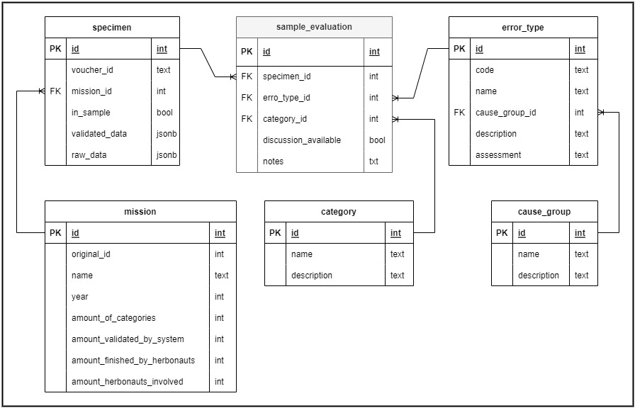

# Readme

Dieses Repository wurde im Rahmen der Bachelorarbeit **"Überprüfung der Datenqualität im Citizen-Science-Projekt "Die Herbonauten" am Botanischen Garten Berlin"** von Ivonne Giske im Fach Umweltinformatik an der HTW Berlin erstellt.

<!--toc:start-->
- [Readme](#readme)
  - [Zweck](#zweck)
  - [Zugriff auf die Datenbank (SQLite)](#zugriff-auf-die-datenbank-sqlite)
  - [Erstellen der Datenbank](#erstellen-der-datenbank)
  - [Installationsvoraussetzungen für die Ausführung weiterer Skripte](#installationsvoraussetzungen-für-die-ausführung-weiterer-skripte)
  - [Liste weiterer Skripte](#liste-weiterer-skripte)
  - [ERM der Datenbank](#erm-der-datenbank)
<!--toc:end-->


## Zweck

Das Repository enthält Daten und Skripte, die zur Erstellung der Projekt-Datenbank sowie weiterer Tabellen und Diagramme zur Auswertung und Fehleranalyse verwendet wurden.

## Zugriff auf die Datenbank (SQLite)

Die Datei `db_20240927.sqlite` im Stammverzeichnis enthält die finale Datenbank. Zur Ansicht eignet sich das Open Source Tool 'DB Browser for SQLite', erhältlich unter https://sqlitebrowser.org/, oder die Webseite https://inloop.github.io/sqlite-viewer/ mit der Tabellen und Views direkt im Browser angeschaut werden können.

## Erstellen der Datenbank
**Voraussetzung**\
aktuelles Python (getestet mit 3.12, minimum >= 3.10)

**Hinweis**\
Das Hauptskript zur Erstellung der Datenbank funktioniert ohne weitere Voraussetzungen,
um die Datenbank von Grund auf neu zu erstellen, führen Sie bitte folgenden Befehl in der Kommandozeile aus:

```pwsh
python3 create_db.py
```
In einigen Fällen lautet der Befehl nur python create_db.py. Danach wird die Datenbank aus den CSV-Dateien der Missionen, Tabellenvorlagen und der Stichprobenauswertung generiert. Ebenso werden einige Views zur Veranschaulichung der Untersuchung und Fehleranalyse erstellt.

Die neu erstellte Datenbank finden Sie als `db_neu.sqlite` im Unterordner `/output`.

**Hiweis**\
Die für die Abschlussarbeit verwendete Version der Datenbank ist zwecks Reproduzierbarkeit als `db_20240927.sqlite` im Stammverzeichnis abgelegt, siehe [Zugriff auf die Datenbank (SQLite)](#zugriff-auf-die-datenbank-sqlite)

## Installationsvoraussetzungen für die Ausführung weiterer Skripte
**Voraussetzung**
aktuelles Python (getestet mit 3.12, minimum >= 3.10)

**Achtung**\
Um weitere Skripte im Unterordner `/scripts` auszuführen, werden zusätzliche Python-Pakete benötigt (matplotlib, pandas). Diese können wie folgt installiert werden.

1. Erstellen einer virtuellen Umgebung für die Python-Abhängigkeiten:

```sh
python -m venv .venv
```

2. Virtuelle Umgebung aktivieren

**Windows**

```pwsh
.venv\Scripts\activate
```

**Linux / Mac**

```sh
source .venv/bin/activate
```

3. Abhängigkeiten installieren

```sh
python -m pip install -r requirements.txt
```

4. Verlassen der virtuellen Umgebung nach Abschluss

```sh
deactivate
```

## Liste weiterer Skripte

Der Ordner `/scripts` enthält folgende Skripte:

| Dateiname                       | Funktion                                                    | Output                       |
| ------------------------------- | ----------------------------------------------------------- | ---------------------------- |
| create_cross_table.py           | erzeugt Kreuztabelle Kategorie Fehlertyp                    | `/output/kreuztabelle.csv`   |
| create_diagram_Fehlerquoten1.py | erzeugt Diagramm der Fehlerquotenentwicklung                | Fenster mit Diagramm         |
| create_diagram_Fehlerquoten2.py | erzeugt Diagramm der aktuellen und potenzielle Fehlerquoten | Fenster mit Diagramm         |
| draw_sample.py                  | zieht eine Stichprobe (voucher_id; mission_id) der Größe `sample_size` aus 12 Herbonauten-Missionen | `/output/sample_example.csv` |

## ERM der Datenbank



